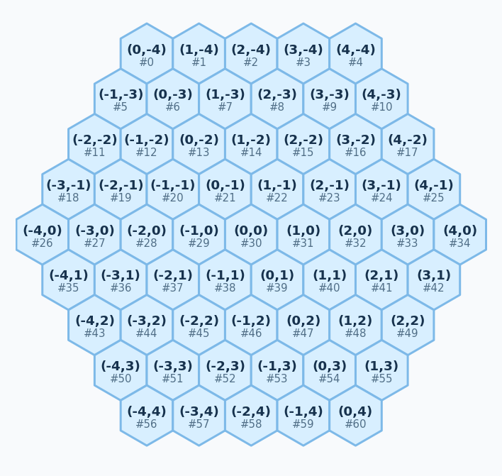

# Catchup Board Coordinate System

The engine represents the 61-cell board with two related identifiers:

- A compact cell index from `0` to `60`.
- An axial hex coordinate `(q, r)`.

Search and game code should usually use cell indices because they are fast array
keys. The axial coordinate exists to define board geometry, neighbors, diagrams,
and future symmetry transforms.

## Board Shape

The board is a radius-4 hexagon with row lengths:

```text
5, 6, 7, 8, 9, 8, 7, 6, 5
```



Rows are stored from top to bottom. The row coordinate `r` runs from `-4` to
`4`.

```text
row 0: r = -4, q =  0..4   -> cells  0..4
row 1: r = -3, q = -1..4   -> cells  5..10
row 2: r = -2, q = -2..4   -> cells 11..17
row 3: r = -1, q = -3..4   -> cells 18..25
row 4: r =  0, q = -4..4   -> cells 26..34
row 5: r =  1, q = -4..3   -> cells 35..42
row 6: r =  2, q = -4..2   -> cells 43..49
row 7: r =  3, q = -4..1   -> cells 50..55
row 8: r =  4, q = -4..0   -> cells 56..60
```

For example:

```python
from catchup.board import BOARD

center = BOARD.index(0, 0)
assert center == 30
assert BOARD.coordinate(30) == (0, 0)
```

## Neighbor Directions

Axial coordinates make hex adjacency simple. Every possible neighbor is one of
these six offsets:

```python
(1, 0), (-1, 0), (0, 1), (0, -1), (1, -1), (-1, 1)
```

`BOARD.neighbors` stores the precomputed neighboring cell indices:

```python
BOARD.neighbors[cell_index] -> tuple[neighbor_cell_index, ...]
```

The type is:

```python
tuple[tuple[int, ...], ...]
```

The outer tuple has one entry for each of the 61 cells. Each inner tuple has the
valid adjacent cell indices for that cell. Center cells have six neighbors;
corner cells have three.

Example:

```python
assert BOARD.neighbors[30] == (31, 29, 39, 21, 22, 38)
```

Those are the six neighbors of coordinate `(0, 0)`:

```text
31 -> ( 1,  0)
29 -> (-1,  0)
39 -> ( 0,  1)
21 -> ( 0, -1)
22 -> ( 1, -1)
38 -> (-1,  1)
```

The incremental component tracker uses this table when a cell is claimed:

```python
for neighbor in board.neighbors[cell]:
    if cell_owners[neighbor] == player:
        union(cell, neighbor)
```

That is why component updates do not need to rescan the whole board.
