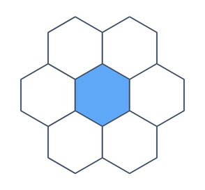
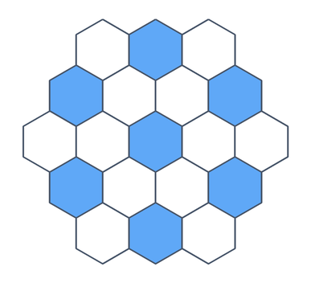
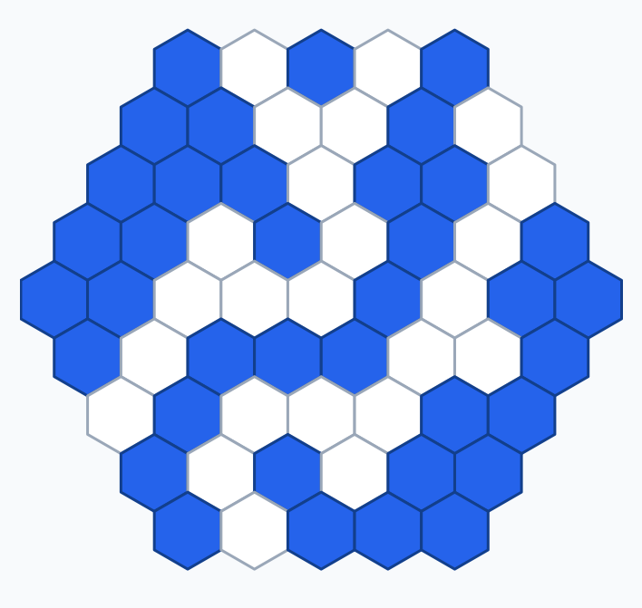
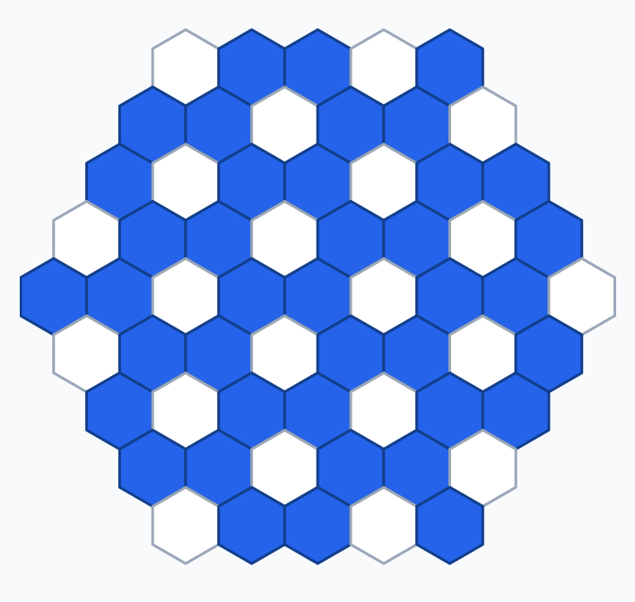

# Catchup Game Analysis

These notes collect strategy observations about Catchup itself, separate from
implementation details.

## Board Symmetries

The Catchup board is a radius-4 regular hexagon on a hex grid. It has 12
geometric symmetries: the six rotations of a hexagon and the six reflections.

```text
rotations:   0, 60, 120, 180, 240, 300 degrees
reflections: 6 mirror axes
total:       12 symmetries
```

This is larger than the 8 symmetries of a square Go board, which has four
rotations and four reflections.

## No Match-Level Tie On The 61-Cell Board

A match-level tie is impossible on the standard 61-cell board.

Catchup compares the players' sorted group-size vectors. For the final result
to be a tie, the two vectors would have to be identical. Identical vectors have
the same sum, so both players would need to own the same total number of cells.

That cannot happen on a full 61-cell board:

```text
blue cells + white cells = 61
```

Two equal integers cannot sum to an odd number. The engine therefore treats a
terminal state with equal component vectors as an invalid state, not as a draw.

## Small-Board Solved Openings

The figures in this section mark first moves, not game positions. Blue cells
are openings from which the first player can force a win; white cells are
losing openings under perfect play.

### Radius 1: 7 Cells



On the radius-1 board, the center is the only winning first move for Blue.
There is also a short direct proof.

After Blue opens in the center, every later Blue claim on the outer ring joins
Blue's center group. If White claims two adjacent outer cells, White's largest
group becomes 2, so Blue gets a three-cell turn and can make a connected group
of 4. White can claim at most the last outer cell after that, so White cannot
match Blue's largest group.

If White claims one outer cell, or two non-adjacent outer cells, White has not
increased the global largest group above 1. Blue gets a two-cell turn. Blue can
choose two outer cells that split the remaining outer ring into White segments
of size at most 2. Blue's group is then the center plus two outer cells, so it
has size 3, and White's largest possible final group is at most 2.

### Radius 2: 19 Cells



The radius-2 board is also a first-player win. The winning openings are the
center and the six side-middle boundary cells:

```text
(0, 0)
(1, -2), (-1, -1), (2, -1), (-2, 1), (1, 1), (-1, 2)
```

Here the proof is by exact minimax over completed turns. A state is represented
by the Blue cell mask, White cell mask, side to move, and next turn's maximum
claim count. Since the board has fewer than 30 cells, the implementation's
early-win bound cannot stop a game before the board is full. Terminal states
are therefore full-board states, scored by the usual lexicographic comparison
of sorted connected-component sizes. At a Blue node, the state is winning if at
least one legal turn leads to a Blue win. At a White node, the state remains
winning for Blue only if every legal White turn leads to a Blue win.

The exact search reduced positions by the 12 geometric symmetries of the hex
board and solved 12,843,651 canonical states. After the center opening, White
has `18 + C(18, 2) = 171` possible first turns, and none of them gives White a
forced win.

## Largest Component-Size Margins

Catchup compares each player's sorted connected-component sizes
lexicographically. In this section, the margin means the size difference at the
first component where the two vectors differ. If one player has no component at
that index, the missing component has size 0.

These examples discuss full-board component vectors. The implementation may
stop some games earlier when reachable-region bounds already prove the winner.

### Largest Group Decides

The biggest legal full-board margin is 40:

```text
winner groups: (41,)
loser groups:  (1, 1, ..., 1)  # 20 singleton groups
margin:        41 - 1 = 40
```

The winner cannot own more than 41 cells in a legal full-board completion: the
first player claims 1 cell on the opening turn, and after that can receive 20
two-cell turns while the opponent claims 1 cell on each intervening turn.
The bound is attainable because the opponent can occupy 20 non-adjacent cells,
leaving the winner's other 41 cells connected.

### Second-Largest Group Decides

The biggest margin is 20:

```text
winner groups: (20, 20, 1)
loser groups:  (20)
margin:        20 - 0 = 20
```

The first groups tie at 20, then the winner's second group beats the opponent's
missing second group. The upper bound is `3m <= 61`: to decide by the second
group with margin `m`, the board must contain at least two winner groups of
size `m` and one loser group of size `m`. Thus `m <= floor(61 / 3) = 20`.
For the legal turn counts, the losing side must claim only 1 cell on each turn:
after the winner's 1-cell opening, 20 loser turns of 1 cell and 20 winner turns
of 2 cells fill the board as 20 loser cells and 41 winner cells. The loser's 20
connected cells can then act as a separator that splits the winner's cells into
two 20-cell regions plus one extra singleton.

### Third-Largest Group Decides

The biggest margin is 12:

```text
winner groups: (12, 12, 12, 1)
loser groups:  (12, 12)
margin:        12 - 0 = 12
```



The upper bound is `5m <= 61`: to decide by the third group with margin `m`,
the first two groups must tie, so the board must contain at least three winner
groups of size `m` and two loser groups of size `m`. Thus `m <= floor(61 / 5) =
12`. The coloring above attains that bound.

## Claiming More Cells Is Usually Good

A basic observation is that, in most positions, the current player should claim
as many cells as legally possible. Extra claimed cells usually give direct
benefits:

```text
more occupied territory
more chances to connect own groups
more chances to block opponent connections
fewer empty cells left for the opponent
```

So an early finish is not usually neutral. Passing up a legal claim often gives
away board control.

## Why Finish Early At All?

The important exception is the Catchup turn-size rule. After a turn, if the
player increased the global largest connected group, the opponent may get up to
three cells on the next turn. If the player did not increase the global largest
group, the opponent gets up to two cells.

That means an extra claim can be bad when it unavoidably increases the global
largest connected group size and gives the opponent a three-cell turn. In that
situation, finishing early may be better than taking a cell that triggers the
opponent's larger response.

So the rough strategic rule is:

```text
claim as much as possible
unless every useful extra claim increases the global largest group size
and giving the opponent three cells is worse than stopping now
```

## Reading The Global-Largest Tax

The cost of growing depends on who currently owns the global largest group.

If the opponent owns the largest group, you can often grow freely until you
match it. Your group may get bigger without increasing the global largest size,
so the opponent does not get the three-cell response just because you caught up
to the existing benchmark.

If you own the largest group, extending it is costly unless the move is
tactically valuable. Any increase to that group can raise the global largest
size and hand the opponent a larger turn.

Merging two own groups can still be worth the tax if the jump is large enough.
For example, connecting two medium groups may create such a strong component
that giving the opponent three cells is acceptable.

A harmless isolated claim is often better than finishing early if it avoids
increasing the global largest size. It still takes territory, reduces future
empty space, and may create later connection threats without paying the
three-cell-turn tax immediately.

This also matters for rollout design. A rollout policy that gives one-cell,
two-cell, and three-cell turns equal probability may be strategically unnatural:
it makes early finishing much more common than it should be in many positions.
A better random rollout policy probably needs to strongly prefer claiming the
maximum number of cells, while still allowing early finish when claiming more
would trigger a strategically bad increase to the global largest group size.

## Empty Region Upper Bound

On the 61-cell radius-4 board, there can be at most 21 empty connected regions.



The empty-region count is exactly bounded by the board graph's maximum
independent set size. Pick one cell from each empty connected region. No two
picked cells can be adjacent, because adjacent empty cells would be in the same
region. Therefore the number of empty regions is at most the maximum
independent set size. Conversely, if an independent set is left empty and every
other cell is claimed, each empty cell is an isolated empty region.

The exact computation in `notes/maximum_independent_set.py` uses the standard
include/exclude recursion for maximum independent set. For a remaining induced
subgraph `G[S]`, let `MIS(S)` return a maximum independent set contained in the
remaining vertex set `S`.

```text
MIS(S):
    if S is empty:
        return empty set

    if S contains isolated vertices:
        take all isolated vertices I
        return I union MIS(S - I)

    choose a vertex v in S

    include = {v} union MIS(S - N[v])
    exclude = MIS(S - {v})

    return the larger of include and exclude
```

Here `N[v]` is the closed neighborhood of `v`: the vertex `v` plus every
neighbor of `v`. If `v` is included, all of `N[v]` must be removed before the
recursive call. If `v` is excluded, only `v` is removed.

The isolated-vertex rule is safe because an isolated vertex has no remaining
neighbors, so some maximum independent set always contains it. The include and
exclude branches are exact because every maximum independent set either contains
the chosen vertex `v` or does not contain it.

The implementation stores each set as a bitmask. `bit_count()` gives the number
of cells selected for the independent set, so the solver compares `include.bit_count()` and
`exclude.bit_count()` to choose the larger independent set. Memoization caches
results by the remaining-vertex bitmask so the same subgraph is not solved more
than once.

This recursive maximum-independent-set check returns size 21 on the Catchup
board.

The helper script also includes a faster row-mask enumeration reference check.
That method uses the board's row structure:

```text
1. For each row, enumerate every row-local mask with no adjacent masked cells
   inside that row.
2. Enumerate compatible choices from one row to the next. Two consecutive row
   masks are compatible when none of their masked cells are adjacent in the
   actual board graph.
3. Score each complete compatible row-mask choice by total masked cells.
4. The best score is 21.
```

This is a useful cross-check because board edges occur only within a row or
between neighboring rows. A compatible choice of one valid mask per row is
therefore exactly an independent set on the whole board.

Since a 21-cell independent set exists, the bound is attainable: leave those 21
non-adjacent cells empty and claim the other 40 cells. Each remaining empty cell
is then its own empty connected region.

One such independent set is:

```text
0, 3, 7, 10, 12, 15, 18, 21, 24, 28, 31, 34, 35, 38, 41, 44, 47, 52, 55, 56, 59
```
