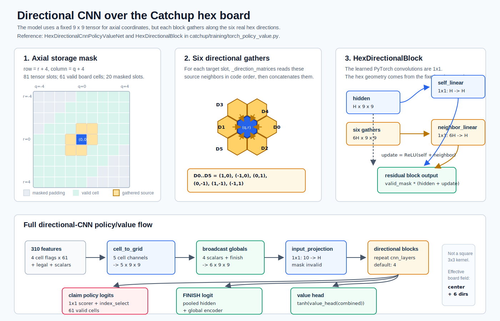

# Model Architectures

This note records the neural model families that have been tried for Catchup, along with their input interpretation, parameter counts, and supervised bootstrap results.

## MLP Model

The original model is `PolicyValueNet`.

Shape:

```text
input 310
Linear(310 -> hidden_size)
ReLU
Linear(hidden_size -> hidden_size)
ReLU
policy head: Linear(hidden_size -> 62)
value head:  Linear(hidden_size -> 1), then tanh
```

With the current default `hidden_size = 128`, the MLP has 64447 trainable
parameters:

```text
Linear(310 -> 128)  310 * 128 + 128 = 39808
Linear(128 -> 128)  128 * 128 + 128 = 16512
policy head          128 * 62  + 62  =  7998
value head           128 * 1   + 1   =   129
total                                     64447
```

The policy output has one score for each action. The value output is between
`-1` and `+1` from the current-player perspective.

Training command:

```sh
python3.10 -m catchup.training.torch_policy_value --data-glob 'data/bootstrap/shard_*_50g_10k.jsonl' --validation-shards 3 --epochs 3 --batch-size 1024 --hidden-size 128 --symmetry-copies 3 --device mps --out data/models/small_policy_value_30shards_3sym.pt --metrics-out data/models/small_policy_value_30shards_3sym_metrics.json
```

Current saved results:

```text
3 epoch MLP:
checkpoint  data/models/small_policy_value_30shards_3sym.pt
validation policy top1  12.8%
validation value acc    63.7%

20 epoch MLP:
checkpoint  data/models/small_policy_value_30shards_3sym_20ep.pt
best validation epoch   19
validation policy top1  18.2%
validation value acc    66.2%
```

## Graph Model

The graph model is `GraphPolicyValueNet`.

It still consumes the same 310-number input, but it interprets the cell part as
61 board cells connected by the real hex-board neighbor list from `BOARD`.

For each cell, the graph model's cell encoder receives these 10 values:

```text
empty_cell
current_player_cell
opponent_cell
selected_this_turn_cell
legal_claim_cell        1.0 if claiming this cell is legal, else 0.0
claimed_this_turn / 3.0
max_claims / 3.0
turn_start_largest / 61.0
opening_turn            1.0 on the opening turn, else 0.0
legal_finish            1.0 if FINISH is legal, else 0.0
```

With hidden size 128 and 4 graph layers, the model does:

```text
encode each cell into 128 numbers
repeat 4 times:
    average each cell's neighboring hidden values
    combine the cell's own hidden value with that neighbor average
    add the update back to the previous cell value
    apply LayerNorm
average all 61 final cell values
combine that board summary with the game-state values
output 61 claim scores, 1 FINISH score, and 1 value
```

The graph layer is residual:

```text
update = ReLU(self_linear(hidden) + neighbor_linear(neighbor_mean))
next_hidden = LayerNorm(hidden + update)
```

With the current defaults `hidden_size = 128` and `gnn_layers = 4`, the graph
model has 201475 trainable parameters:

```text
cell encoder, Linear(10 -> 128)       10 * 128 + 128 =   1408
one graph layer:
    self Linear(128 -> 128)          128 * 128 + 128 =  16512
    neighbor Linear(128 -> 128)      128 * 128 + 128 =  16512
    LayerNorm(128)                   128 + 128       =    256
    one layer total                                    =  33280
4 graph layers                                          133120
global encoder, Linear(5 -> 128)       5 * 128 + 128 =    768
policy head:
    claim score, Linear(128 -> 1)    128 * 1   + 1   =    129
    FINISH score subnetwork:
        Linear(256 -> 128)           256 * 128 + 128 =  32896
        Linear(128 -> 1)             128 * 1   + 1   =    129
    policy head total                                  =  33154
value head:
    Linear(256 -> 128)               256 * 128 + 128 =  32896
    Linear(128 -> 1)                 128 * 1   + 1   =    129
    value head total                                   =  33025
total                                                   201475
```

The graph model also stores a fixed `61 x 61` neighbor matrix as a buffer. That
matrix has 3721 floating-point entries, but it is not trainable and is not
included in the parameter count.

The graph model is still small. It is meant to give the network direct access to
the board topology without adding hand-built component features.

Training command:

```sh
python3.10 -m catchup.training.torch_policy_value --architecture gnn --gnn-layers 4 --data-glob 'data/bootstrap/shard_*_50g_10k.jsonl' --validation-shards 3 --epochs 3 --batch-size 1024 --hidden-size 128 --symmetry-copies 3 --device mps --out data/models/gnn_policy_value_30shards_3sym_3ep.pt --metrics-out data/models/gnn_policy_value_30shards_3sym_3ep_metrics.json
```

Saved results:

```text
3 epoch graph model:
checkpoint  data/models/gnn_policy_value_30shards_3sym_3ep.pt
validation policy top1  28.0%
validation value acc    69.2%

20 epoch graph model:
checkpoint  data/models/gnn_policy_value_30shards_3sym_20ep.pt
best validation epoch   18
validation policy top1  33.2%
validation value acc    71.7%
final epoch 20 policy top1 32.9%
final epoch 20 value acc   70.6%
```

Quick arena checks:

```text
3 epoch GNN greedy vs random, 20 pairs:              38-2
3 epoch GNN neural-puct:20 vs random, 10 pairs:      20-0
3 epoch GNN greedy vs mcts:1000, 5 pairs:             1-9

20 epoch GNN greedy vs random, 20 pairs:             40-0
20 epoch GNN neural-puct:20 vs random, 10 pairs:     20-0
20 epoch GNN greedy vs mcts:1000, 5 pairs:            0-10
20 epoch GNN neural-puct:20 vs mcts:1000, 5 pairs:    3-7
20 epoch GNN neural-puct:100 vs mcts:1000, 5 pairs:   7-3
```

So the graph model is clearly better than the first MLP and random play, but it
is not yet competitive with the C++ random-rollout MCTS baseline at 1000
simulations.

## Directional CNN Model Experiment

```text
architecture=directional-cnn
```



The directional CNN tests whether a fixed-board convolution can beat the
current graph model while preserving the real hex-neighbor directions. It still
consumes the same 310-number feature vector. It maps the 61 board cells into a
`9 x 9` axial-coordinate grid:

```text
row = r + 4
column = q + 4
```

The 20 invalid padded grid locations are masked after each layer. The model then
extracts the 61 valid claim logits from the grid and appends the FINISH logit.

The directional CNN uses six direction-specific neighbor aggregations matching
the axial hex directions:

```text
(1, 0), (-1, 0), (0, 1), (0, -1), (1, -1), (-1, 1)
```

This is a hex 1-ring convolution, not a normal square `3 x 3` convolution.
Each block first gathers the hidden state from the six adjacent hex directions,
then concatenates those six directional neighbor tensors. The learned PyTorch
`Conv2d` operations are both `1 x 1`:

```text
self path       Conv2d(hidden_size -> hidden_size, kernel_size=1)
neighbor path   Conv2d(6 * hidden_size -> hidden_size, kernel_size=1)
next hidden     hidden + ReLU(self path + neighbor path)
```

The learned kernel size is `1 x 1`, but the effective board kernel is:

```text
center cell + 6 adjacent hex cells
```

So each directional block has a radius-1, 7-position hex receptive field. With
4 stacked blocks, a cell representation can receive information from up to
roughly hex distance 4.

Complete `directional-cnn` parameter count with `hidden_size = 64` and
`cnn_layers = 4`:

```text
input projection:
    Conv2d(10 -> 64, 1x1)           10 * 64 + 64        =    704

directional blocks:
    one block:
        self Conv2d(64 -> 64)       64 * 64 + 64        =   4160
        dir Conv2d(384 -> 64)       6 * 64 * 64 + 64    =  24640
        one block total                                     28800
    4 blocks                                             115200

global encoder:
    Linear(5 -> 64)                 5 * 64 + 64         =    384

policy head:
    claim Conv2d(64 -> 1, 1x1)      64 * 1 + 1          =     65
    FINISH subnetwork:
        Linear(128 -> 64)           128 * 64 + 64       =   8256
        Linear(64 -> 1)             64 * 1 + 1          =     65
    policy head total                                       8386

value head:
    Linear(128 -> 64)               128 * 64 + 64       =   8256
    Linear(64 -> 1)                 64 * 1 + 1          =     65
    value head total                                        8321

total:
    704 + 115200 + 384 + 8386 + 8321 = 132995
```

For size comparison:

```text
directional-CNN h64 directional blocks only: 115200
directional-CNN h64 whole model:              132995

GNN h128 message layers only:                 133120
GNN h128 whole model:                         201475
```

The h64 directional-CNN whole model is about the same size as the h128 GNN's
message-passing stack alone.

Training command:

```sh
python3.10 -m catchup.training.torch_policy_value --architecture directional-cnn --cnn-layers 4 --data-glob 'data/bootstrap/shard_*_50g_10k.jsonl' --validation-shards 3 --epochs 20 --batch-size 1024 --hidden-size 64 --symmetry-copies 3 --device mps --out data/models/directional_cnn_h64_noplayer_30shards_3sym_20ep.pt --metrics-out data/models/directional_cnn_h64_noplayer_30shards_3sym_20ep_metrics.json
```

Saved artifacts:

```text
data/models/directional_cnn_h64_noplayer_30shards_3sym_20ep.pt
data/models/directional_cnn_h64_noplayer_30shards_3sym_20ep_metrics.json
data/models/directional_cnn_h64_noplayer_30shards_3sym_20ep_exported_b64.pt2
data/models/directional_cnn_h64_noplayer_30shards_3sym_20ep_aoti_mps_b64.pt2
```

Validation results:

```text
best validation loss          epoch 20, 3.2112
best validation policy top1   epoch 18, 35.7%
best validation value acc     epoch 18, 70.7%
final epoch policy top1       35.4%
final epoch value acc         70.5%
training epoch seconds        754.0
```

The supervised validation metrics look better than the 20-epoch GNN baseline.
One important export bug showed up in the directional-CNN claim-policy readout.
The problematic expression was:

```python
claim_logits = torch.matmul(claim_grid, self.grid_to_cell)
```

This is mathematically just a gather from the 9x9 storage grid back to the 61
real cells, but the compiled AOTI package gave wrong legal-action priors.

The fix is to express the same readout as direct indexing:

```python
claim_logits = claim_grid.index_select(1, self.cell_grid_indices)
```
