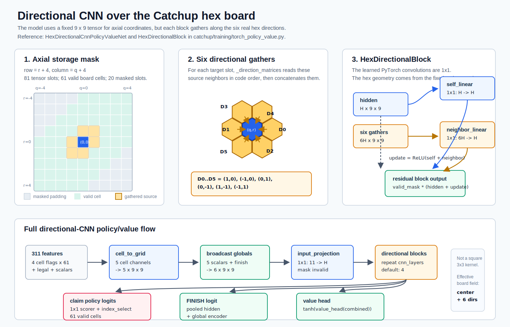

# Model Training

This note records the current supervised bootstrap setup for neural Catchup
models. It is not the full AlphaZero loop yet. The current model learns from
bootstrap positions generated by the C++ PUCT teacher.

## Bootstrap Data

The C++ generator is `catchup/cpp/self_play.cpp`.

Example command:

```sh
catchup/cpp/build/catchup_self_play --games 50 --simulations 10000 --threads 12 --out data/bootstrap/shard_0001_50g_10k.jsonl
```

Normal data generation omits `--seed`, so each run uses fresh randomness. Use
`--seed` only for reproducible debugging.

Each JSONL line is one internal Catchup action position. A real Catchup turn can
contain more than one internal action because the player may claim more than one
cell before finishing the turn.

The sample has:

```text
state          position before the chosen internal action
policy_target 62 numbers, one per action
value_target  final result from state's current_player perspective
terminal      final game summary
meta          generator metadata for debugging
```

The 62 actions are:

```text
0..60  claim that board cell
61     finish the current turn
```

`policy_target` is the teacher search visit distribution at that position. The
self-play move is sampled from the teacher visits, so the data is not always the
single most visited action.

`value_target` is:

```text
+1  the player to move in this saved state eventually won
 0  tie
-1  the player to move in this saved state eventually lost
```

The current bootstrap directory has 30 shards:

```text
data/bootstrap/shard_0001_50g_10k.jsonl
...
data/bootstrap/shard_0030_50g_10k.jsonl
```

That is 1500 self-play games and 79384 saved positions.

## State Fields

The saved `state` contains:

```text
owners               61 entries: -1 empty, 0 Blue, 1 White
current_player       0 Blue or 1 White
selected_this_turn   cells already claimed in the current unfinished turn
claimed_this_turn    number of cells already claimed in this turn
max_claims           most cells this player may claim this turn
turn_start_largest   global largest connected group size at turn start
opening_turn         whether this is the first move special case
legal_mask           62 true/false entries for legal actions
```

The model input is built in `sample_to_arrays()` in
`catchup/training/torch_policy_value.py`.

The current input is 310 numbers:

```text
244 cell-state numbers
 62 legal-action numbers
  4 game-state numbers
---
310 total
```

The 244 cell-state numbers are four 0/1 features for each of the 61 cells:

```text
empty_cell              1.0 if owners[cell] == -1, else 0.0
current_player_cell     1.0 if owners[cell] == current_player, else 0.0
opponent_cell           1.0 if owners[cell] == opponent, else 0.0
selected_this_turn_cell 1.0 if cell is in selected_this_turn, else 0.0
```

Each feature is stored as a floating-point `0.0` or `1.0`.

The 62 legal-action numbers are copied from `legal_mask`.

The 4 game-state numbers are:

```text
claimed_this_turn / 3.0
max_claims / 3.0
turn_start_largest / 61.0
opening_turn as 1.0 or 0.0
```

`current_player` remains in the saved JSON because it defines the relative cell
planes and the value-target perspective. It is not passed as its own scalar
input. The board planes already tell the model which stones belong to the player
to move and which belong to the opponent; adding an absolute Blue/White scalar
encouraged side-specific shortcuts.

The model does not currently receive component sizes, empty-region data,
reachable-region bounds, or explicit group adjacency as separate inputs.

## Symmetry Augmentation

The loader is `catchup/training/data_loader.py`.

It can apply the 12 symmetries of the hex board:

```text
6 rotations
6 reflected rotations
```

Current supervised bootstrap training uses `--symmetry-copies 3`: every raw
sample is kept, and each augmentable raw sample gets three additional randomly
transformed symmetry views for that epoch.

Only turn-boundary samples are augmented, where:

```text
selected_this_turn == []
```

Mid-turn samples are left unchanged because internal actions are canonicalized
by increasing cell index. A rotation or reflection can change that order and
make the transformed mid-turn sample invalid.

## MLP Model

The original model is `PolicyValueNet`.

Shape:

```text
input 310
Linear(310 -> hidden_size)
ReLU
Linear(hidden_size -> hidden_size)
ReLU
policy head: Linear(hidden_size -> 62)
value head:  Linear(hidden_size -> 1), then tanh
```

With the current default `hidden_size = 128`, the MLP has 64447 trainable
parameters:

```text
Linear(310 -> 128)  310 * 128 + 128 = 39808
Linear(128 -> 128)  128 * 128 + 128 = 16512
policy head          128 * 62  + 62  =  7998
value head           128 * 1   + 1   =   129
total                                     64447
```

The policy output has one score for each action. The value output is between
`-1` and `+1` from the current-player perspective.

Training command:

```sh
python3.10 -m catchup.training.torch_policy_value --data-glob 'data/bootstrap/shard_*_50g_10k.jsonl' --validation-shards 3 --epochs 3 --batch-size 1024 --hidden-size 128 --symmetry-copies 3 --device mps --out data/models/small_policy_value_30shards_3sym.pt --metrics-out data/models/small_policy_value_30shards_3sym_metrics.json
```

Current saved results:

```text
3 epoch MLP:
checkpoint  data/models/small_policy_value_30shards_3sym.pt
validation policy top1  12.8%
validation value acc    63.7%

20 epoch MLP:
checkpoint  data/models/small_policy_value_30shards_3sym_20ep.pt
best validation epoch   19
validation policy top1  18.2%
validation value acc    66.2%
```

## Graph Model

The graph model is `GraphPolicyValueNet`.

It still consumes the same 310-number input, but it interprets the cell part as
61 board cells connected by the real hex-board neighbor list from `BOARD`.

For each cell, the graph model's cell encoder receives these 10 values:

```text
empty_cell
current_player_cell
opponent_cell
selected_this_turn_cell
legal_claim_cell        1.0 if claiming this cell is legal, else 0.0
claimed_this_turn / 3.0
max_claims / 3.0
turn_start_largest / 61.0
opening_turn            1.0 on the opening turn, else 0.0
legal_finish            1.0 if FINISH is legal, else 0.0
```

With hidden size 128 and 4 graph layers, the model does:

```text
encode each cell into 128 numbers
repeat 4 times:
    average each cell's neighboring hidden values
    combine the cell's own hidden value with that neighbor average
    add the update back to the previous cell value
    apply LayerNorm
average all 61 final cell values
combine that board summary with the game-state values
output 61 claim scores, 1 FINISH score, and 1 value
```

The graph layer is residual:

```text
update = ReLU(self_linear(hidden) + neighbor_linear(neighbor_mean))
next_hidden = LayerNorm(hidden + update)
```

With the current defaults `hidden_size = 128` and `gnn_layers = 4`, the graph
model has 201475 trainable parameters:

```text
cell encoder, Linear(10 -> 128)       10 * 128 + 128 =   1408
one graph layer:
    self Linear(128 -> 128)          128 * 128 + 128 =  16512
    neighbor Linear(128 -> 128)      128 * 128 + 128 =  16512
    LayerNorm(128)                   128 + 128       =    256
    one layer total                                    =  33280
4 graph layers                                          133120
global encoder, Linear(5 -> 128)       5 * 128 + 128 =    768
policy head:
    claim score, Linear(128 -> 1)    128 * 1   + 1   =    129
    FINISH score subnetwork:
        Linear(256 -> 128)           256 * 128 + 128 =  32896
        Linear(128 -> 1)             128 * 1   + 1   =    129
    policy head total                                  =  33154
value head:
    Linear(256 -> 128)               256 * 128 + 128 =  32896
    Linear(128 -> 1)                 128 * 1   + 1   =    129
    value head total                                   =  33025
total                                                   201475
```

The graph model also stores a fixed `61 x 61` neighbor matrix as a buffer. That
matrix has 3721 floating-point entries, but it is not trainable and is not
included in the parameter count.

The graph model is still small. It is meant to give the network direct access to
the board topology without adding hand-built component features.

Training command:

```sh
python3.10 -m catchup.training.torch_policy_value --architecture gnn --gnn-layers 4 --data-glob 'data/bootstrap/shard_*_50g_10k.jsonl' --validation-shards 3 --epochs 3 --batch-size 1024 --hidden-size 128 --symmetry-copies 3 --device mps --out data/models/gnn_policy_value_30shards_3sym_3ep.pt --metrics-out data/models/gnn_policy_value_30shards_3sym_3ep_metrics.json
```

Saved results:

```text
3 epoch graph model:
checkpoint  data/models/gnn_policy_value_30shards_3sym_3ep.pt
validation policy top1  28.0%
validation value acc    69.2%

20 epoch graph model:
checkpoint  data/models/gnn_policy_value_30shards_3sym_20ep.pt
best validation epoch   18
validation policy top1  33.2%
validation value acc    71.7%
final epoch 20 policy top1 32.9%
final epoch 20 value acc   70.6%
```

Quick arena checks:

```text
3 epoch GNN greedy vs random, 20 pairs:              38-2
3 epoch GNN neural-puct:20 vs random, 10 pairs:      20-0
3 epoch GNN greedy vs mcts:1000, 5 pairs:             1-9

20 epoch GNN greedy vs random, 20 pairs:             40-0
20 epoch GNN neural-puct:20 vs random, 10 pairs:     20-0
20 epoch GNN greedy vs mcts:1000, 5 pairs:            0-10
20 epoch GNN neural-puct:20 vs mcts:1000, 5 pairs:    3-7
20 epoch GNN neural-puct:100 vs mcts:1000, 5 pairs:   7-3
```

So the graph model is clearly better than the first MLP and random play, but it
is not yet competitive with the C++ random-rollout MCTS baseline at 1000
simulations.

## Directional CNN Model Experiment

```text
architecture=directional-cnn
```



The directional CNN tests whether a fixed-board convolution can beat the
current graph model while preserving the real hex-neighbor directions. It still
consumes the same 310-number feature vector. It maps the 61 board cells into a
`9 x 9` axial-coordinate grid:

```text
row = r + 4
column = q + 4
```

The 20 invalid padded grid locations are masked after each layer. The model then
extracts the 61 valid claim logits from the grid and appends the FINISH logit.

The directional CNN uses six direction-specific neighbor aggregations matching
the axial hex directions:

```text
(1, 0), (-1, 0), (0, 1), (0, -1), (1, -1), (-1, 1)
```

This is a hex 1-ring convolution, not a normal square `3 x 3` convolution.
Each block first gathers the hidden state from the six adjacent hex directions,
then concatenates those six directional neighbor tensors. The learned PyTorch
`Conv2d` operations are both `1 x 1`:

```text
self path       Conv2d(hidden_size -> hidden_size, kernel_size=1)
neighbor path   Conv2d(6 * hidden_size -> hidden_size, kernel_size=1)
next hidden     hidden + ReLU(self path + neighbor path)
```

The learned kernel size is `1 x 1`, but the effective board kernel is:

```text
center cell + 6 adjacent hex cells
```

So each directional block has a radius-1, 7-position hex receptive field. With
4 stacked blocks, a cell representation can receive information from up to
roughly hex distance 4.

Hidden-size 64 is the first serious directional-CNN comparison. It keeps 4
directional blocks but uses fewer channels than the 128-dimensional GNN:

```text
directional-CNN, hidden_size 64, cnn_layers 4: 132995 trainable parameters
GNN, hidden_size 128, gnn_layers 4:            201475 trainable parameters
```

Complete `directional-cnn` parameter count with `hidden_size = 64` and
`cnn_layers = 4`:

```text
input projection:
    Conv2d(10 -> 64, 1x1)           10 * 64 + 64        =    704

directional blocks:
    one block:
        self Conv2d(64 -> 64)       64 * 64 + 64        =   4160
        dir Conv2d(384 -> 64)       6 * 64 * 64 + 64    =  24640
        one block total                                     28800
    4 blocks                                             115200

global encoder:
    Linear(5 -> 64)                 5 * 64 + 64         =    384

policy head:
    claim Conv2d(64 -> 1, 1x1)      64 * 1 + 1          =     65
    FINISH subnetwork:
        Linear(128 -> 64)           128 * 64 + 64       =   8256
        Linear(64 -> 1)             64 * 1 + 1          =     65
    policy head total                                       8386

value head:
    Linear(128 -> 64)               128 * 64 + 64       =   8256
    Linear(64 -> 1)                 64 * 1 + 1          =     65
    value head total                                        8321

total:
    704 + 115200 + 384 + 8386 + 8321 = 132995
```

For size comparison:

```text
directional-CNN h64 directional blocks only: 115200
directional-CNN h64 whole model:              132995

GNN h128 message layers only:                 133120
GNN h128 whole model:                         201475
```

So yes, the h64 directional-CNN whole model is about the same size as the h128
GNN's message-passing stack alone. The h128 GNN's full parameter count is higher
because its cell encoder, global encoder, policy head, and value head also use
128-wide hidden vectors. The directional block learns different mixing weights
for each of the six directions. A cheaper later variant would sum or average the
six directional neighbor tensors first, then project `hidden_size ->
hidden_size`; that would keep exact hex directions while making each directional
block smaller.

Training command:

```sh
python3.10 -m catchup.training.torch_policy_value --architecture directional-cnn --cnn-layers 4 --data-glob 'data/bootstrap/shard_*_50g_10k.jsonl' --validation-shards 3 --epochs 20 --batch-size 1024 --hidden-size 64 --symmetry-copies 3 --device mps --out data/models/directional_cnn_h64_noplayer_30shards_3sym_20ep.pt --metrics-out data/models/directional_cnn_h64_noplayer_30shards_3sym_20ep_metrics.json
```

Saved artifacts:

```text
data/models/directional_cnn_h64_noplayer_30shards_3sym_20ep.pt
data/models/directional_cnn_h64_noplayer_30shards_3sym_20ep_metrics.json
data/models/directional_cnn_h64_noplayer_30shards_3sym_20ep_exported_b64.pt2
data/models/directional_cnn_h64_noplayer_30shards_3sym_20ep_aoti_mps_b64.pt2
```

Validation results:

```text
best validation loss          epoch 20, 3.2112
best validation policy top1   epoch 18, 35.7%
best validation value acc     epoch 18, 70.7%
final epoch policy top1       35.4%
final epoch value acc         70.5%
training epoch seconds        754.0
```

The supervised validation metrics look better than the 20-epoch GNN baseline.
One important export bug showed up in the directional-CNN claim-policy readout.
The problematic expression was:

```python
claim_logits = torch.matmul(claim_grid, self.grid_to_cell)
```

This is mathematically just a gather from the 9x9 storage grid back to the 61
real cells. The exported program matched eager PyTorch, but the compiled AOTI
package gave wrong legal-action priors:

```text
old AOTI package, opening board:
Python checkpoint top action 30
AOTI package top action     40
legal prior L1 error        0.7826

old AOTI package, early_a:
Python checkpoint top action 14
AOTI package top action     42
legal prior L1 error        1.4376
```

The fix is to express the same readout as direct indexing:

```python
claim_logits = claim_grid.index_select(1, self.cell_grid_indices)
```

The fixed package was checked against the Python checkpoint on legal priors.

Historical arena sanity checks after the export fix, before the `noplayer`
feature-contract change:

```text
directional-CNN h64 neural-puct:100 vs GNN 20ep neural-puct:100
pairs 5, games 10, threads 5, seed 1
result 8-2
real 96.89s

directional-CNN h64 neural-puct:100 vs mcts:1000
pairs 5, games 10, threads 5, seed 1
result 7-3
real 54.13s
```

No-player base retrain diagnostics:

```text
checkpoint
data/models/directional_cnn_h64_noplayer_30shards_3sym_20ep.pt

AOTI package, batch 64
data/models/directional_cnn_h64_noplayer_30shards_3sym_20ep_aoti_mps_b64.pt2

same-model deterministic arena
neural-puct:100 vs same model
pairs 64, games 128, threads 64, seed 1
result A 64, B 64, ties 0
A as Blue  0-64-0
A as White 64-0-0
real 79.63s

same-model stochastic arena, visit-count sampling
neural-puct:100 vs same model
pairs 64, games 128, threads 64
agent-a-action-selection sample, agent-b-action-selection sample, seed 1
result A 51, B 77, ties 0
A as Blue  26-38-0
A as White 25-39-0
B as Blue  39-25-0
B as White 38-26-0
real 96.41s

same-model stochastic arena, visit-count sampling
neural-puct:100 vs same model
pairs 64, games 128, threads 64
agent-a-action-selection sample, agent-b-action-selection sample, seed 2
result A 76, B 52, ties 0
A as Blue  39-25-0
A as White 37-27-0
B as Blue  27-37-0
B as White 25-39-0
real 92.92s

generator-style stochastic probe
neural-puct:100, 200 games, threads 64, no fixed seed
samples 10123
winners Blue 94, White 106
average filled cells 49.565
average completed turns 22.33
path /private/tmp/catchup_noplayer_npuct100_selfplay_probe_200g.jsonl
```

The deterministic arena still follows a single White-winning line. That does not
by itself prove the self-play generator is skewed, because the generator samples
actions from visit counts and adds decayed root noise. The 200-game generator
probe is the more relevant check for self-play diversity. In stochastic arena
mode, seed 1 favored B and seed 2 favored A; across those two seeds the same
model was roughly balanced by agent label and color.

## Losses And Metrics

The training loss is:

```text
policy loss + value_weight * value loss
```

Current `value_weight` default is `1.0`.

Policy loss compares the model's action probabilities to the teacher visit
distribution.

Value loss is mean squared error against `value_target`.

Reported metrics:

```text
policy_top1     whether the model's highest-scored action matches the
                highest-visit teacher action

value_accuracy  whether sign(model value) matches sign(value_target)
```

`policy_top1` is easy to read but incomplete. If the teacher assigns similar
visit counts to several actions, predicting the second-best action can be
reasonable even though `policy_top1` counts it as wrong.

## Model Export

For C++ neural PUCT on MPS, the current preferred path is:

```text
trained PyTorch checkpoint
-> torch.export exported program
-> AOTInductor .pt2 package
-> C++ AOTIModelPackageLoader
-> MPS tensors
```

Do not use TorchScript for new work. PyTorch's current docs say TorchScript is
deprecated and recommend `torch.export` instead.

The export helper is:

```text
catchup/training/export_aoti.py
```

Example command:

```sh
python3.10 -m catchup.training.export_aoti --checkpoint data/models/gnn_policy_value_30shards_3sym_20ep.pt --exported-program data/models/gnn_policy_value_30shards_3sym_20ep_exported.pt2 --package data/models/gnn_policy_value_30shards_3sym_20ep_aoti_mps.pt2 --device mps
```

Commands involving MPS should be run unsandboxed.

The installed PyTorch 2.12 build currently writes the AOTInductor package but
then raises an internal `AssertionError`. The export helper treats that as a
warning only when the requested package file exists. If the package is missing,
it fails.

The C++ neural evaluator lives in:

```text
catchup/cpp/puct_neural.cpp
```

It loads the `.pt2` package with:

```text
torch::inductor::AOTIModelPackageLoader
```

and runs one `(1, 310)` input tensor on:

```text
at::kMPS
```

The loader should use device index `-1` for this MPS package. Passing explicit
device index `0` failed with:

```text
Incorrect device passed to aoti_runner_mps
```

## Neural PUCT Use

`catchup/neural_puct.py` loads checkpoints through checkpoint metadata, so both
MLP and graph checkpoints use the same evaluator.

Example:

```sh
python3.10 -m catchup.neural_puct --checkpoint data/models/gnn_policy_value_30shards_3sym_3ep.pt --simulations 100 --device mps
```

For each evaluated state, the neural evaluator returns:

```text
policy priors over legal actions
value from current_player perspective
```

The Python neural PUCT prototype then uses the policy to guide tree selection
and uses the value instead of rolling the game out to the end.

## C++ Neural PUCT

The C++ neural search is split into:

```text
catchup/cpp/puct_neural.hpp
catchup/cpp/puct_neural.cpp
```

The C++ arena accepts a neural agent in this form:

```text
neural-puct:N:MODEL.pt2
```

Example:

```sh
catchup/cpp/build/catchup_arena --agent-a neural-puct:100:data/models/gnn_policy_value_30shards_3sym_20ep_aoti_mps_b32.pt2 --agent-b mcts:1000 --pairs 5 --threads 8 --neural-batch-size 32 --seed 1
```

`NeuralEvaluator` loads the AOTInductor package with
`torch::inductor::AOTIModelPackageLoader`, builds the same 310-number feature
vector as the Python loader, runs the model on MPS, then normalizes policy
logits only over legal actions.

`NeuralPuctMcts` uses the model value at each newly reached non-terminal leaf.
There is no random rollout in this path.

The arena uses `BatchedNeuralEvaluator` when either side is a neural PUCT agent.
If both neural agents use the same model path, they share one batcher. If they
use different model paths, each model gets its own batcher.

## Batched Neural Evaluation

The current C++ arena and self-play implementations batch evaluations across
games, not inside one game's search tree. Each game thread still runs its PUCT
loop in order. When a search needs a model evaluation, it sends the leaf state
to one shared evaluator and waits for the result. The evaluator collects
requests from multiple game threads, runs one MPS batch, then returns each
result to the game that requested it.

That gives this shape:

```text
game worker 0 -> leaf state ----\
game worker 1 -> leaf state ----- shared BatchedNeuralEvaluator -> model batch
game worker 2 -> leaf state ----/
```

This does not use virtual loss or any other within-tree synchronization trick.
The order of decisions inside each self-play game is preserved.

The current C++ generator uses the same `NeuralPuctMcts` implementation for
single-state and batched use. The difference is only the evaluator object:

```text
NeuralEvaluator         -> one model call for one state
BatchedNeuralEvaluator  -> one model call for several queued states
```

For arena benchmarking, the number of active game workers matters. A batcher
shared by too few active neural-vs-neural games can be underfed:

```text
neural-puct:100 vs neural-puct:100
pairs 16, games 32, threads 16, neural batch size 32
real 114.10s
average internal actions 57.9
```

With 32 active workers, the same batch size was much better utilized:

```text
neural-puct:100 vs neural-puct:100
pairs 32, games 64, threads 32, neural batch size 32
real 52.80s
average internal actions 57.5
```

Practical rule: for fixed-batch neural arena runs, keep the number of active
game workers near the inference batch size, or use a smaller exported batch
size.

For the no-player directional-CNN h64 package, batch 128 was faster than batch
64 on the same 256-game stochastic same-model arena workload:

```text
neural-puct:100 vs neural-puct:100
pairs 128, games 256
agent-a-action-selection sample, agent-b-action-selection sample, seed 3

threads 64,  neural batch size 64:   real 180.77s, 0.706s/game
threads 128, neural batch size 128:  real 154.05s, 0.602s/game

throughput speedup: 1.17x
wall-time reduction: 14.8%
```

Batch wait profiling on the no-player directional-CNN h64 package:

```text
model        data/models/directional_cnn_h64_noplayer_iter_0008_npuct400_replay_aoti_mps_b128.pt2
games        128
simulations  100
threads      128
batch size   128
seed         123
```

```text
wait_ms  real_s  avg_batch  full_batch  total_fill_wait_ms  avg_model_ms  avg_request_ms
2.00      92.36    100.34      64.5%             5630.82        13.54          14.25
1.00      88.99    100.32      64.0%             2910.05        13.47          13.86
0.50      84.64    100.29      63.9%             1470.30        13.05          13.41
0.25      85.61    100.21      62.1%              806.77        13.25          13.66
0.00      90.47     91.59      55.4%                0.00        12.99          13.76
```

The old `2.0ms` wait spent measurable time waiting without improving batch
size over `0.5ms`. No deliberate wait (`0.0ms`) made batches smaller and was
slower. The current C++ default is therefore `--neural-batch-wait-ms 0.5`.

Internal timing for the `0.5ms` run, with an explicit MPS synchronization after
`loader.run()`:

```text
avg_model_ms        13.302
avg_feature_ms       0.049
avg_input_ms         0.667
avg_aoti_ms         12.063
avg_output_ms        0.488
avg_postprocess_ms   0.027
```

`avg_aoti_ms` is the real bottleneck. Without the explicit MPS synchronization,
this time appeared under output copy because copying tensors back to CPU forced
the queued MPS work to finish.

CPU AOTI inference was much slower than MPS for the same no-player
directional-CNN h64 checkpoint and the same 128-game, 100-simulation
self-play profile:

```text
model checkpoint data/models/directional_cnn_h64_noplayer_iter_0008_npuct100cont_replay.pt
games            128
simulations      100
threads          128
batch size       128
wait_ms          0.5
seed             123
```

```text
device  package suffix   real_s  requests  batches  avg_batch  avg_model_ms  avg_aoti_ms  avg_request_ms
mps     aoti_mps_b128     76.37    604524     5804    104.16        12.30        11.08          12.71
cpu     aoti_cpu_b128    739.25    607804     5866    103.62       125.24       125.05         125.38
```

The CPU package did not reduce inference overhead. It was about 9.7x slower in
wall time, and the batch model call itself was about 10.2x slower.

AOTInductor packages are exported for a fixed input batch size, so the package
batch size must match the generator's `--neural-batch-size`. For a batch of 32:

```sh
python3.10 -m catchup.training.export_aoti --checkpoint data/models/gnn_policy_value_30shards_3sym_20ep.pt --exported-program data/models/gnn_policy_value_30shards_3sym_20ep_exported_b32.pt2 --package data/models/gnn_policy_value_30shards_3sym_20ep_aoti_mps_b32.pt2 --device mps --batch-size 32
```

Generate neural self-play data with:

```sh
catchup/cpp/build/catchup_self_play --teacher neural-puct --model data/models/gnn_policy_value_30shards_3sym_20ep_aoti_mps_b32.pt2 --games 50 --simulations 100 --threads 12 --neural-batch-size 32 --out data/neural_self_play/example_50g.jsonl
```

For neural self-play data, root Dirichlet noise is enabled by default. The
effective root noise weight is:

```text
root_noise_epsilon
* (legal_action_count / root_noise_reference_actions) ^ root_noise_action_power
* (empty_cells / 61) ^ root_noise_empty_power
```

The current defaults are:

```text
root_noise_epsilon                  0.25
root_dirichlet_total_concentration  10.0
root_noise_reference_actions        61
root_noise_action_power             0.5
root_noise_empty_power              1.0
```

So the opening gets substantial, spiky exploration noise, while late-game roots
get much less noise.

First neural self-play collection:

```sh
catchup/cpp/build/catchup_self_play --teacher neural-puct --model data/models/directional_cnn_h64_30shards_3sym_20ep_aoti_mps_b64_gather.pt2 --games 640 --simulations 100 --threads 64 --neural-batch-size 64 --out data/neural_self_play/iter_0001_directional_h64_npuct100_640g_b64_root_noise_decay.jsonl
```

Result:

```text
samples                  33160
games                    640
average positions/game   51.8125
min positions/game       37
max positions/game       67
output size              44M
wall time                392.97s
```

The shard metadata records the model, batch size, and root-noise schedule in
`meta.teacher`.

No-player warm-up collection and stronger-search iterations:

```text
base model
data/models/directional_cnn_h64_noplayer_30shards_3sym_20ep_aoti_mps_b128.pt2

self-play settings
iter_0001 through iter_0005  neural-puct:100
iter_0006                    neural-puct:200
iter_0007 through iter_0009  neural-puct:400
games per generation      640
threads                   128
neural batch size         128
root noise                default decayed schedule
seed                      random_device, not fixed
output directory          data/neural_self_play_noplayer/
```

Generated shards:

```text
generation  sims  samples  Blue wins  White wins  avg filled  avg turns
iter_0001    100    32691        342         298      49.919    22.462
iter_0002    100    33083        304         336      50.427    22.356
iter_0003    100    32360        297         343      49.652    21.977
iter_0004    100    32351        311         329      49.567    21.995
iter_0005    100    32216        300         340      49.475    22.092
iter_0006    200    33613        314         326      51.645    22.972
iter_0007    400    33454        325         315      51.625    23.150
iter_0008    400    33465        303         337      51.642    23.225
iter_0009    400    33728        313         327      51.875    23.278
```

Saved shard paths:

```text
data/neural_self_play_noplayer/iter_0001_directional_h64_noplayer_npuct100_640g_b128_root_noise_decay.jsonl
data/neural_self_play_noplayer/iter_0002_directional_h64_noplayer_npuct100_640g_b128_root_noise_decay.jsonl
data/neural_self_play_noplayer/iter_0003_directional_h64_noplayer_npuct100_640g_b128_root_noise_decay.jsonl
data/neural_self_play_noplayer/iter_0004_directional_h64_noplayer_npuct100_640g_b128_root_noise_decay.jsonl
data/neural_self_play_noplayer/iter_0005_directional_h64_noplayer_npuct100_640g_b128_root_noise_decay.jsonl
data/neural_self_play_noplayer/iter_0006_directional_h64_noplayer_npuct200_640g_b128_root_noise_decay.jsonl
data/neural_self_play_noplayer/iter_0007_directional_h64_noplayer_npuct400_640g_b128_root_noise_decay.jsonl
data/neural_self_play_noplayer/iter_0008_directional_h64_noplayer_npuct400_640g_b128_root_noise_decay.jsonl
data/neural_self_play_noplayer/iter_0009_directional_h64_noplayer_npuct400_640g_b128_root_noise_decay.jsonl
```

Replay training results:

```text
generation  train batches  sampled positions  seconds  loss    policy loss  value loss
iter_0001              26              13312    2.360  2.9713      2.2708      0.7005
iter_0002              52              26624    4.636  2.8225      2.1564      0.6661
iter_0003              76              38912    6.330  2.8079      2.1334      0.6744
iter_0004             102              52224    8.933  2.7023      2.0867      0.6156
iter_0005             126              64512   10.268  2.6565      2.0482      0.6082
iter_0006             132              67584   11.649  2.6399      2.0061      0.6338
iter_0007             131              67072   11.519  2.6948      1.9853      0.7095
iter_0008             131              67072   11.818  2.6952      1.9392      0.7560
iter_0009             132              67584   11.562  2.7173      1.9253      0.7920
```

Final five-generation sample rates with `K = 5`, `gamma = 0.8`, and target
lifetime coverage `2.0`:

```text
iter_0001  12.12%
iter_0002  15.44%
iter_0003  18.94%
iter_0004  23.67%
iter_0005  29.83%
```

For `iter_0006`, the replay window rolled forward to `iter_0002` through
`iter_0006`. Its sample rates were:

```text
iter_0002  12.26%
iter_0003  15.30%
iter_0004  18.88%
iter_0005  23.89%
iter_0006  29.67%
```

For `iter_0007`, the replay window rolled forward to `iter_0003` through
`iter_0007`. Its sample rates were:

```text
iter_0003  12.21%
iter_0004  15.18%
iter_0005  19.03%
iter_0006  23.62%
iter_0007  29.95%
```

For `iter_0008`, the replay window rolled forward to `iter_0004` through
`iter_0008`. Its sample rates were:

```text
iter_0004  12.32%
iter_0005  15.30%
iter_0006  18.87%
iter_0007  23.72%
iter_0008  29.80%
```

For `iter_0009`, the replay window rolled forward to `iter_0005` through
`iter_0009`. Its sample rates were:

```text
iter_0005  12.29%
iter_0006  15.37%
iter_0007  19.13%
iter_0008  23.65%
iter_0009  29.56%
```

Saved replay checkpoints and batch-128 packages:

```text
data/models/directional_cnn_h64_noplayer_iter_0001_replay.pt
data/models/directional_cnn_h64_noplayer_iter_0001_replay_aoti_mps_b128.pt2
data/models/directional_cnn_h64_noplayer_iter_0002_replay.pt
data/models/directional_cnn_h64_noplayer_iter_0002_replay_aoti_mps_b128.pt2
data/models/directional_cnn_h64_noplayer_iter_0003_replay.pt
data/models/directional_cnn_h64_noplayer_iter_0003_replay_aoti_mps_b128.pt2
data/models/directional_cnn_h64_noplayer_iter_0004_replay.pt
data/models/directional_cnn_h64_noplayer_iter_0004_replay_aoti_mps_b128.pt2
data/models/directional_cnn_h64_noplayer_iter_0005_replay.pt
data/models/directional_cnn_h64_noplayer_iter_0005_replay_aoti_mps_b128.pt2
data/models/directional_cnn_h64_noplayer_iter_0006_npuct200_replay.pt
data/models/directional_cnn_h64_noplayer_iter_0006_npuct200_replay_aoti_mps_b128.pt2
data/models/directional_cnn_h64_noplayer_iter_0007_npuct400_replay.pt
data/models/directional_cnn_h64_noplayer_iter_0007_npuct400_replay_aoti_mps_b128.pt2
data/models/directional_cnn_h64_noplayer_iter_0008_npuct400_replay.pt
data/models/directional_cnn_h64_noplayer_iter_0008_npuct400_replay_aoti_mps_b128.pt2
data/models/directional_cnn_h64_noplayer_iter_0009_npuct400_replay.pt
data/models/directional_cnn_h64_noplayer_iter_0009_npuct400_replay_aoti_mps_b128.pt2
```

Arena check against the no-player bootstrap model:

```text
A = data/models/directional_cnn_h64_noplayer_iter_0005_replay_aoti_mps_b128.pt2
B = data/models/directional_cnn_h64_noplayer_30shards_3sym_20ep_aoti_mps_b128.pt2
neural-puct:100
pairs 128, games 256, threads 128, batch size 128, seed 1

deterministic max-visit action selection:
A wins 128, B wins 128, ties 0
A as Blue  128-0-0
A as White 0-128-0
B as Blue  128-0-0
B as White 0-128-0
real 149.47s

stochastic visit-count action selection:
A wins 190, B wins 66, ties 0
A score rate 74.2% (95% CI 68.9%..79.6%)
A as Blue  103-25-0
A as White 87-41-0
B as Blue  41-87-0
B as White 25-103-0
real 272.09s
```

The deterministic max-visit check is color dominated, so it does not separate
model strength in this matchup. The stochastic visit-count check strongly favors
the five-generation replay model over the bootstrap model.

Arena checks against heuristic `puct:10000:prior=heuristic:rollout=biased`:

```text
generation  search            seed  games  result  score rate  Blue result  White result
iter_0006   neural-puct:200      1    128   36-92       28.1%      20-44         16-48
iter_0007   neural-puct:200      1    128   41-87       32.0%      21-43         20-44
iter_0007   neural-puct:400      1    128   58-70       45.3%      26-38         32-32
iter_0008   neural-puct:200      1    128   35-93       27.3%      21-43         14-50
iter_0008   neural-puct:400      1    128   47-81       36.7%      20-44         27-37
iter_0009   neural-puct:400      1     40   12-28       30.0%       5-15          7-13
```

These checks suggest the post-`iter_0007` regression is real enough to
investigate before continuing the same loop.

100-simulation continuation branch from `iter_0005`:

```text
data directory  data/neural_self_play_noplayer_npuct100_cont/
checkpoint tag  npuct100cont
iter_0006 through iter_0014 all use neural-puct:100 for self-play generation.
```

Generated shards:

```text
generation  sims  samples  Blue wins  White wins  avg filled  avg turns
iter_0006    100    32656        317         323      50.078    22.269
iter_0007    100    32343        335         305      49.598    21.973
iter_0008    100    32794        306         334      50.264    22.397
iter_0009    100    32166        321         319      49.438    22.042
iter_0010    100    32914        294         346      50.542    22.559
iter_0011    100    32625        330         310      49.944    22.372
iter_0012    100    32773        309         331      50.217    22.473
iter_0013    100    32805        330         310      50.147    22.414
iter_0014    100    32688        311         329      50.072    22.381
```

Replay training:

```text
generation  train batches  sampled positions  seconds  loss    policy loss  value loss
iter_0006             128              65536   10.685  2.6323      2.0087      0.6236
iter_0007             127              65024   10.458  2.6001      1.9809      0.6192
iter_0008             129              66048   10.206  2.5470      1.9397      0.6074
iter_0009             126              64512   11.156  2.5263      1.9319      0.5944
iter_0010             129              66048   10.990  2.5225      1.9003      0.6223
iter_0011             128              65536   10.444  2.5256      1.8960      0.6296
iter_0012             129              66048   11.580  2.4889      1.8719      0.6170
iter_0013             129              66048   11.031  2.4901      1.8775      0.6126
iter_0014             128              65536   11.179  2.4776      1.8616      0.6161
```

Arena checks against heuristic `puct:10000:prior=heuristic:rollout=biased`:

```text
generation  search            seed  games  result  score rate  Blue result  White result
iter_0006   neural-puct:100      1    128   27-101      21.1%      15-49         12-52
iter_0006   neural-puct:200      1    128   41-87       32.0%      25-39         16-48
iter_0006   neural-puct:400      1    128   54-74       42.2%      28-36         26-38
iter_0006   neural-puct:800      1    128   43-85       33.6%      22-42         21-43
iter_0007   neural-puct:100      1    128   31-97       24.2%      11-53         20-44
iter_0007   neural-puct:200      1    128   35-93       27.3%      15-49         20-44
iter_0007   neural-puct:400      1    128   41-87       32.0%      23-41         18-46
iter_0007   neural-puct:800      1    128   46-82       35.9%      25-39         21-43
iter_0008   neural-puct:100      1    128   39-89       30.5%      22-42         17-47
iter_0008   neural-puct:200      1    128   36-92       28.1%      17-47         19-45
iter_0008   neural-puct:400      1    128   46-82       35.9%      25-39         21-43
iter_0008   neural-puct:800      1    128   53-75       41.4%      29-35         24-40
iter_0009   neural-puct:100      1     40    9-31       22.5%       4-16          5-15
iter_0014   neural-puct:100      1    128   27-101      21.1%      13-51         14-50
```

The 100-simulation branch did not show the same monotonic decline as the
400-simulation branch, and its replay value loss improved instead of worsening.
It also did not clearly beat the best 400-simulation checkpoint in arena.

Direct neural-vs-neural arena checks must use visit-count sampling. Deterministic
max-visit action selection can collapse into repeated lines and is not model
strength evidence for these neural checkpoints. `catchup_arena` now defaults to
visit-count sampling for both agents when both agents are `neural-puct`.

```text
A = data/models/directional_cnn_h64_noplayer_iter_0007_npuct100cont_replay_aoti_mps_b128.pt2
B = data/models/directional_cnn_h64_noplayer_iter_0008_npuct100cont_replay_aoti_mps_b128.pt2
both search = neural-puct:100
pairs 64, games 128, threads 64, batch size 128, seed 1
agent-a-action-selection sample
agent-b-action-selection sample
A wins 46, B wins 82, ties 0
A score rate 35.9% (95% CI 27.6%..44.2%)
A as Blue  27-37-0
A as White 19-45-0
real 280.26s

A = data/models/directional_cnn_h64_noplayer_iter_0014_npuct100cont_replay_aoti_mps_b128.pt2
B = data/models/directional_cnn_h64_noplayer_iter_0008_npuct100cont_replay_aoti_mps_b128.pt2
both search = neural-puct:100
pairs 64, games 128, threads 64, batch size 128, seed 1
agent-a-action-selection sample
agent-b-action-selection sample
A wins 75, B wins 53, ties 0
A score rate 58.6% (95% CI 50.1%..67.1%)
A as Blue  42-22-0
A as White 33-31-0
real 264.67s
```

Arena checks against `mcts:10000`:

```text
A = data/models/directional_cnn_h64_noplayer_iter_0005_replay_aoti_mps_b128.pt2
B = mcts:10000
A search = neural-puct:100
pairs 20, games 40, threads 20, batch size 128, seed 1
A wins 19, B wins 21, ties 0
A score rate 47.5% (95% CI 32.0%..63.0%)
A as Blue  10-10-0
A as White 9-11-0
real 100.26s

A = data/models/directional_cnn_h64_noplayer_iter_0006_npuct200_replay_aoti_mps_b128.pt2
B = mcts:10000
A search = neural-puct:200
pairs 20, games 40, threads 20, batch size 128, seed 1
A wins 22, B wins 18, ties 0
A score rate 55.0% (95% CI 39.6%..70.4%)
A as Blue  8-12-0
A as White 14-6-0
real 208.24s
```

The 200-simulation model/search was better in this small match, but the sample
is too small to treat the 22-18 score as a stable estimate.

## Replay Buffer Coverage

Keep this section operational. For replay training, count raw positions, not
augmented views. Symmetry augmentation changes the view of a sampled position;
it does not create a new independent game position.

Use these controls:

```text
K          replay window size, in self-play generations
N          saved positions in a shard, roughly equal across shards
C          target lifetime coverage per raw position
B          raw positions sampled for one training update after generation
age        generation age, where 0 is newest
gamma      recency decay for age weighting
```

Training budget:

```text
B = C * N
training_batches = ceil(B / batch_size)
```

During warm-up, when fewer than `K` generations exist:

```text
loaded_generations = min(K, available_generations)
B = C * N * (loaded_generations / K)
```

Sampling:

```text
1. choose a generation using generation_probability(age)
2. choose one raw position uniformly inside that generation
3. apply one random legal symmetry view when augmentation is enabled
```

Age weights:

```text
age_weight(age) = gamma ^ age
generation_probability(age) =
    age_weight(age) / sum_{i=0}^{loaded_generations - 1} age_weight(i)
```

Current settings:

```text
K = 5
C = 2.0
gamma = 0.8
batch_size = 512
```

Do not overwrite older checkpoints. Each neural generation should write a new
checkpoint name.

Observed no-player replay runs:

```text
generation  train batches  sampled positions  sampled generation rates
iter_0001              26              13312    [100.00]
iter_0002              52              26624    [44.34, 55.66]
iter_0003              76              38912    [26.19, 32.70, 41.11]
iter_0004             102              52224    [17.49, 21.59, 27.05, 33.88]
iter_0005             126              64512    [12.12, 15.44, 18.94, 23.67, 29.83]
iter_0006             132              67584    [12.26, 15.30, 18.88, 23.89, 29.67]
iter_0007             131              67072    [12.21, 15.18, 19.03, 23.62, 29.95]
iter_0008             131              67072    [12.32, 15.30, 18.87, 23.72, 29.80]
iter_0009             132              67584    [12.29, 15.37, 19.13, 23.65, 29.56]
100-cont iter_0006   128              65536    [12.28, 15.21, 18.83, 23.58, 30.10]
100-cont iter_0007   127              65024    [12.26, 15.32, 18.92, 23.55, 29.95]
100-cont iter_0008   129              66048    [12.27, 15.48, 18.88, 23.84, 29.53]
100-cont iter_0009   126              64512    [12.15, 15.26, 18.91, 23.79, 29.89]
100-cont iter_0010   129              66048    [12.13, 15.51, 19.23, 23.48, 29.64]
100-cont iter_0011   128              65536    [12.23, 15.18, 18.91, 23.83, 29.84]
100-cont iter_0012   129              66048    [12.32, 15.42, 19.18, 23.57, 29.52]
100-cont iter_0013   129              66048    [12.22, 15.32, 19.17, 23.48, 29.81]
100-cont iter_0014   128              65536    [12.08, 15.55, 18.92, 23.70, 29.74]
```

## Known Gaps

Likely next improvements:

```text
train the graph model longer
try a wider graph model
add component-size or reachable-region features
use richer value targets from terminal group sizes
generate data with stronger teacher searches
start a real iterative AlphaZero-style loop
```
